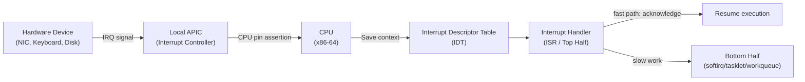

# Chapter 06 — Interrupts and Interrupt Handlers

## Overview

Interrupts are the mechanism by which hardware signals the CPU that it requires attention. The kernel must respond quickly without blocking normal execution flow.



## Topics

| File | Topic |
|------|-------|
| [01_Interrupt_Basics.md](./01_Interrupt_Basics.md) | IRQs, exceptions, hardware vs software interrupts |
| [02_Interrupt_Handlers.md](./02_Interrupt_Handlers.md) | Writing ISRs, IRQF_* flags, constraints |
| [03_Registering_An_Interrupt_Handler.md](./03_Registering_An_Interrupt_Handler.md) | request_irq(), free_irq(), /proc/interrupts |
| [04_IRQ_Stacks.md](./04_IRQ_Stacks.md) | Per-CPU IRQ stacks, NMI stack, double fault |
| [05_Interrupt_Control.md](./05_Interrupt_Control.md) | local_irq_disable/enable, spin_lock_irqsave |

## Key Kernel Files

```
arch/x86/kernel/irq.c          — x86 IRQ handling
arch/x86/kernel/entry_64.S     — Low-level entry, IDT setup
kernel/irq/manage.c            — request_irq, free_irq
kernel/irq/chip.c              — IRQ chip abstraction
include/linux/interrupt.h      — All IRQ APIs
```
