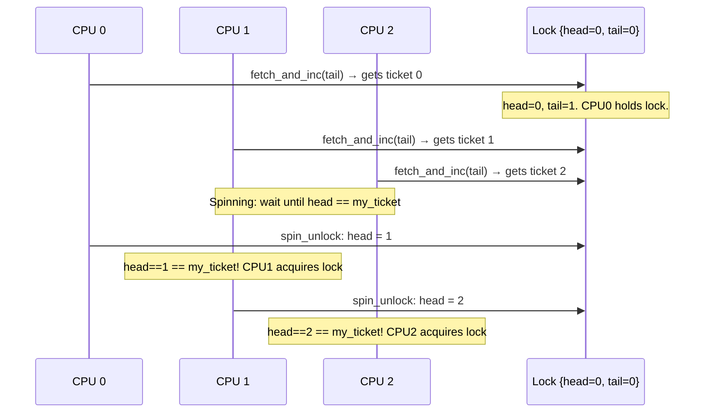

# 02 — Spin Locks

## 1. What is a Spinlock?

A **spinlock** is a lock where the waiting thread **busy-waits** (spins in a loop) until the lock becomes available. It is the most fundamental kernel locking primitive.

**Key characteristics:**
- **No sleeping** — spins (wastes CPU time) while waiting
- **Very low overhead** when uncontended (simple atomic CAS)
- Best for **short critical sections** (microseconds)
- Disables **kernel preemption** while held
- Works in **any context** (interrupt, process, atomic)

---

## 2. Data Structure

```c
/* include/linux/spinlock_types.h */
typedef struct spinlock {
    union {
        struct raw_spinlock rlock;
    };
} spinlock_t;

struct raw_spinlock {
    arch_spinlock_t raw_lock;
    /* ... lockdep fields ... */
};

/* x86-64 implementation: */
typedef struct arch_spinlock {
    union {
        __ticketpair_t head_tail;      /* ticket lock */
        struct __raw_tickets {
            __ticket_t head, tail;
        } tickets;
    };
} arch_spinlock_t;
```

---

## 3. Ticket Lock Algorithm (x86)

Linux uses a **ticket spinlock** — like a deli counter — to ensure fairness (FIFO order):



---

## 4. Basic API

```c
/* Static initialization */
DEFINE_SPINLOCK(my_lock);

/* Dynamic initialization */
spinlock_t my_lock;
spin_lock_init(&my_lock);

/* Basic lock/unlock */
spin_lock(&my_lock);
/* --- critical section --- */
spin_unlock(&my_lock);

/* Trylock — non-blocking, returns 1 if acquired, 0 if failed */
if (spin_trylock(&my_lock)) {
    /* got it */
    spin_unlock(&my_lock);
}
```

---

## 5. IRQ-Safe Variants

```c
unsigned long flags;

/* Disable local IRQs + acquire lock */
spin_lock_irqsave(&my_lock, flags);       /* saves RFLAGS, then cli */
/* critical section — shared with IRQ handlers */
spin_unlock_irqrestore(&my_lock, flags);  /* restores RFLAGS */

/* Alternative (only if you know IRQs were enabled before) */
spin_lock_irq(&my_lock);
spin_unlock_irq(&my_lock);

/* Disable bottom halves + acquire lock */
spin_lock_bh(&my_lock);
spin_unlock_bh(&my_lock);
```

---

## 6. When to Use Each Variant

| Scenario | Use |
|----------|-----|
| Process context only | `spin_lock / spin_unlock` |
| Process context + BH (tasklet/softirq) | `spin_lock_bh / spin_unlock_bh` |
| Process context + hard IRQ | `spin_lock_irqsave / spin_unlock_irqrestore` |
| Inside IRQ handler | `spin_lock / spin_unlock` (IRQs already disabled) |

---

## 7. Critical Section Constraints

```c
spin_lock(&my_lock);

/* ALLOWED: */
access_shared_data();       /* Main purpose */
atomic_inc(&counter);       /* Atomic ops */
readl(mmio_reg);            /* MMIO */
tasklet_schedule(&t);       /* Schedule deferred work */

/* NOT ALLOWED: */
// kmalloc(size, GFP_KERNEL);    /* GFP_KERNEL may sleep */
// mutex_lock(&mx);              /* Sleep */
// msleep(1);                    /* Sleep */
// copy_to_user(ptr, buf, len);  /* May fault */
// schedule();                   /* Explicitly yield */

spin_unlock(&my_lock);
```

---

## 8. Preemption

Spinlocks **disable preemption** on the local CPU:

```c
/* spin_lock() effectively does: */
preempt_disable();
/* + acquire the lock */

/* spin_unlock() does: */
/* + release the lock */
preempt_enable();  /* May trigger schedule() if TIF_NEED_RESCHED set */
```

This prevents a "holder preemption" scenario where the lock holder is preempted, blocking all spinners indefinitely.

---

## 9. Debugging

```bash
# CONFIG_DEBUG_SPINLOCK=y  — catches:
# - double-lock
# - unlock without lock
# - irq state at lock time

# CONFIG_LOCKDEP=y — detects:
# - AB-BA deadlocks
# - irq-safe/unsafe lock mix
```

---

## 10. Source Files

| File | Description |
|------|-------------|
| `include/linux/spinlock.h` | Full API |
| `include/linux/spinlock_types.h` | spinlock_t definition |
| `arch/x86/include/asm/spinlock.h` | x86 ticket lock |
| `kernel/locking/spinlock.c` | Debugging wrappers |

---

## 11. Related Concepts
- [03_Reader_Writer_Spin_Locks.md](./03_Reader_Writer_Spin_Locks.md) — rwlock_t
- [05_Mutex.md](./05_Mutex.md) — For sleepable critical sections
- [../06_Interrupts_And_Interrupt_Handlers/05_Interrupt_Control.md](../06_Interrupts_And_Interrupt_Handlers/05_Interrupt_Control.md) — IRQ control with locks
