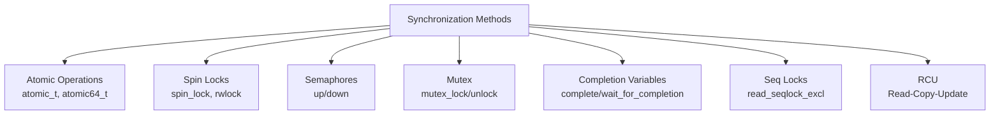

# Chapter 09 — Kernel Synchronization Methods

## Overview

This chapter covers every synchronization primitive available in the Linux kernel, from the simplest atomic operations to the sophisticated RCU mechanism.

## Topics

| File | Topic |
|------|-------|
| [01_Atomic_Operations.md](./01_Atomic_Operations.md) | atomic_t, bitops, memory barriers |
| [02_Spin_Locks.md](./02_Spin_Locks.md) | spin_lock family |
| [03_Reader_Writer_Spin_Locks.md](./03_Reader_Writer_Spin_Locks.md) | rwlock_t |
| [04_Semaphores.md](./04_Semaphores.md) | struct semaphore, up/down |
| [05_Mutex.md](./05_Mutex.md) | struct mutex — preferred sleeping lock |
| [06_Completion_Variables.md](./06_Completion_Variables.md) | struct completion — one-shot events |
| [07_Seq_Locks.md](./07_Seq_Locks.md) | seqlock_t — writer-priority |
| [08_RCU.md](./08_RCU.md) | Read-Copy-Update — scalable reads |
| [09_Memory_Ordering.md](./09_Memory_Ordering.md) | Barriers, smp_mb(), WRITE_ONCE |
