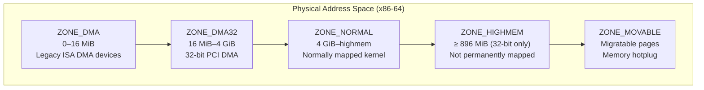
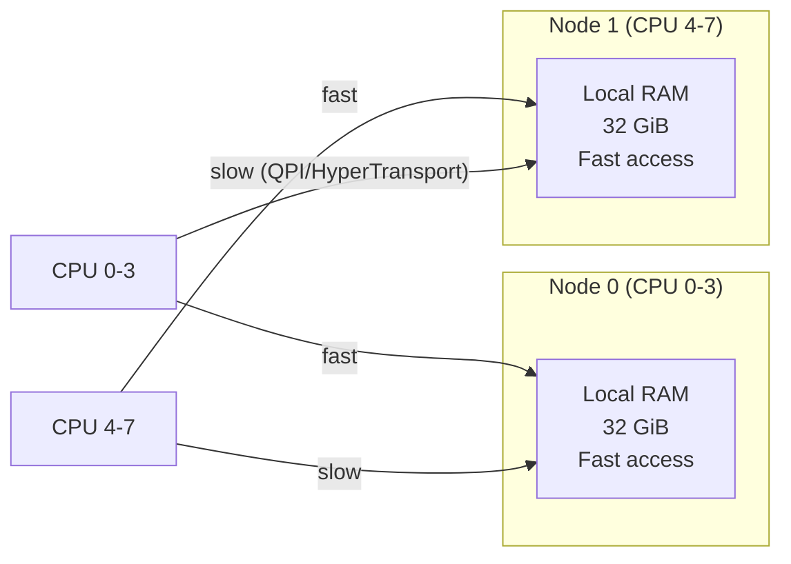

# 01 — Pages and Zones

## 1. Physical Memory Basics

The kernel divides physical memory into **pages** (4 KiB on x86). Each page is tracked by a `struct page`:

```c
/* include/linux/mm_types.h */
struct page {
    unsigned long flags;        /* PG_locked, PG_dirty, PG_uptodate, ... */
    union {
        struct address_space *mapping;  /* Page cache or anon mapping */
        struct {
            union {
                pgoff_t index;          /* Page cache offset */
                unsigned long share;
            };
        };
        struct list_head lru;   /* LRU list (page reclaim) */
    };
    atomic_t    _refcount;      /* Reference count */
    atomic_t    _mapcount;      /* Number of page table entries */
    /* ... */
} __attribute__((packed));
```

---

## 2. Memory Zones

Physical memory is divided into **zones** based on hardware constraints:



```c
/* include/linux/mmzone.h */
enum zone_type {
    ZONE_DMA,
    ZONE_DMA32,
    ZONE_NORMAL,
#ifdef CONFIG_HIGHMEM
    ZONE_HIGHMEM,
#endif
    ZONE_MOVABLE,
    __MAX_NR_ZONES
};

struct zone {
    unsigned long   _watermark[NR_WMARK]; /* min/low/high watermarks */
    unsigned long   watermark_boost;
    unsigned long   nr_reserved_highatomic;
    long            lowmem_reserve[MAX_NR_ZONES];
    struct pglist_data *zone_pgdat;
    struct per_cpu_pages __percpu *per_cpu_pageset;
    unsigned long   zone_start_pfn;
    atomic_long_t   managed_pages;
    /* ... free_area[] buddy lists ... */
};
```

---

## 3. NUMA Nodes

On NUMA (Non-Uniform Memory Access) machines, memory is split into **nodes**:



```c
/* include/linux/mmzone.h */
struct pglist_data {  /* = struct pg_data_t */
    struct zone     node_zones[MAX_NR_ZONES];
    int             nr_zones;
    unsigned long   node_start_pfn;  /* First PFN in this node */
    unsigned long   node_present_pages;
    int             node_id;
    /* ... */
};
```

---

## 4. Page Flags

```c
/* include/linux/page-flags.h */
/* Test/set/clear with PageXxx / SetPageXxx / ClearPageXxx */

PG_locked        /* Page is being read/written — locked */
PG_dirty         /* Page has been modified, needs writeback */
PG_uptodate      /* Page data is valid */
PG_referenced    /* Page recently accessed (LRU) */
PG_active        /* Page on active LRU list */
PG_swapcache     /* Page is in swap cache */
PG_writeback     /* Page being written to disk */
PG_reclaim       /* Page being reclaimed */
PG_reserved      /* Do not swap this page */

/* Usage: */
if (PageDirty(page))        /* Check PG_dirty */
    writeback_page(page);
SetPageDirty(page);         /* Mark page dirty */
ClearPageDirty(page);
```

---

## 5. Page Frame Numbers (PFN)

```c
/* Convert between PFN and page/address */
unsigned long pfn = page_to_pfn(page);
struct page *page = pfn_to_page(pfn);
void *addr = page_to_virt(page);        /* Kernel virtual address */
struct page *page = virt_to_page(addr);
phys_addr_t phys = page_to_phys(page);  /* Physical address */
struct page *page = phys_to_page(phys);
```

---

## 6. /proc/zoneinfo

```bash
cat /proc/zoneinfo
# Node 0, zone      DMA
#   pages free     3970
#         min      33
#         low      41
#         high     49
# ...
# Node 0, zone   Normal
#   pages free     246789
```

---

## 7. Source Files

| File | Description |
|------|-------------|
| `include/linux/mm_types.h` | struct page |
| `include/linux/mmzone.h` | struct zone, pglist_data |
| `include/linux/page-flags.h` | PG_* flags |
| `mm/page_alloc.c` | Zone allocator |

---

## 8. Related Concepts
- [02_Buddy_Allocator.md](./02_Buddy_Allocator.md) — How pages are allocated
- [../14_Process_Address_Space/](../14_Process_Address_Space/) — Virtual memory map
- [../15_Page_Cache_And_Page_Writeback/](../15_Page_Cache_And_Page_Writeback/) — Pages in page cache
