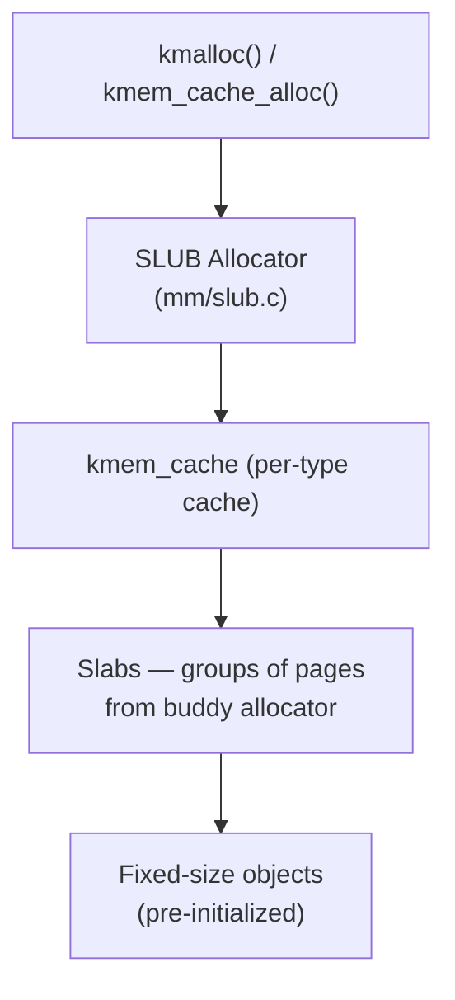
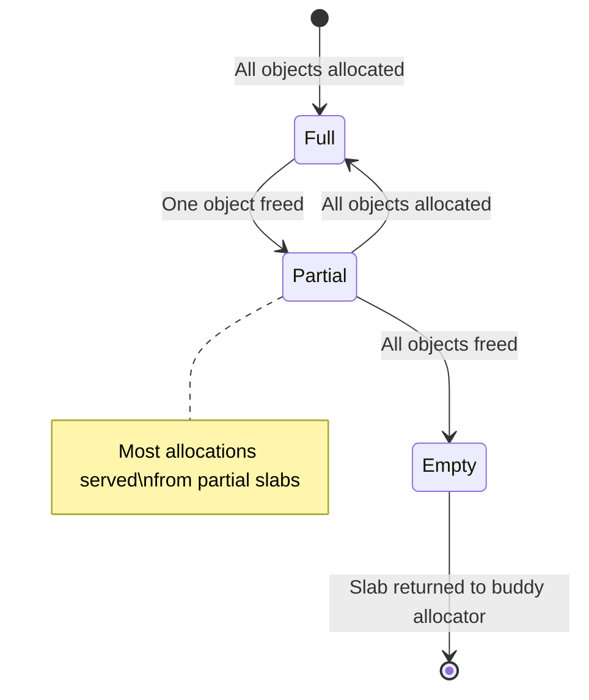

# 03 — Slab Allocator

## 1. Overview

The **slab allocator** provides **object-level caching** on top of the buddy allocator.

Problem: `alloc_pages()` only allocates in powers of 2. For small/frequent objects (like `task_struct`, `inode`, `dentry`), this wastes memory and causes overhead.

Solution: Pre-allocate slabs of pages → carve into fixed-size objects → reuse.

---

## 2. SLAB / SLUB / SLOB

| Allocator | Linux | Notes |
|-----------|-------|-------|
| SLAB | 2.2+ | Original; per-CPU magazines; complex |
| SLUB | 2.6.23+ | **Default today**; simpler; better perf; NUMA-aware |
| SLOB | Embedded | Tiny systems (<256 MiB RAM); no per-CPU cache |



---

## 3. Key Structures

```c
/* A cache is one per object type */
struct kmem_cache {
    struct kmem_cache_cpu __percpu *cpu_slab;  /* Per-CPU slab pointer */
    unsigned int    size;        /* Object size */
    unsigned int    object_size; /* Real object size */
    unsigned int    offset;      /* Free pointer offset */
    struct kmem_cache_node *node[MAX_NUMNODES];
    const char      *name;
    struct list_head list;
    /* ... */
};
```

---

## 4. kmem_cache API

```c
#include <linux/slab.h>

/* Create a cache for objects of 'size' bytes */
struct kmem_cache *cache = kmem_cache_create(
    "myobj_cache",      /* name (shown in /proc/slabinfo) */
    sizeof(struct myobj),
    0,                  /* align (0 = default) */
    SLAB_HWCACHE_ALIGN, /* flags */
    NULL                /* ctor (constructor, can be NULL) */
);

/* Allocate one object */
struct myobj *obj = kmem_cache_alloc(cache, GFP_KERNEL);

/* Free one object */
kmem_cache_free(cache, obj);

/* Destroy cache (must have no outstanding objects) */
kmem_cache_destroy(cache);
```

---

## 5. Slab Lifecycle



---

## 6. Object Initialization (ctor)

```c
void myobj_ctor(void *obj)
{
    struct myobj *m = obj;
    spin_lock_init(&m->lock);  /* Initialize once, reused across alloc/free */
    INIT_LIST_HEAD(&m->list);
}

struct kmem_cache *cache = kmem_cache_create("myobj",
    sizeof(struct myobj), 0, 0, myobj_ctor);
```

Constructors are called at slab creation — the object arrives **pre-initialized** at `kmem_cache_alloc()`.

---

## 7. Real Kernel Examples

```c
/* fs/inode.c — inode cache */
inode_cachep = kmem_cache_create("inode_cache",
    sizeof(struct inode), 0,
    SLAB_RECLAIM_ACCOUNT | SLAB_MEM_SPREAD | SLAB_ACCOUNT,
    init_once);

/* kernel/fork.c — task_struct */
task_struct_cachep = kmem_cache_create("task_struct",
    arch_task_struct_size, align,
    SLAB_PANIC | SLAB_ACCOUNT, NULL);
```

---

## 8. SLAB Flags

| Flag | Meaning |
|------|---------|
| `SLAB_HWCACHE_ALIGN` | Align objects to cache line |
| `SLAB_PANIC` | Panic if creation fails |
| `SLAB_RECLAIM_ACCOUNT` | Reclaimable slab memory |
| `SLAB_POISON` | Poison freed objects (debug) |
| `SLAB_RED_ZONE` | Add redzone padding (debug) |
| `SLAB_ACCOUNT` | Account memory via memcg |

---

## 9. Checking Slab Usage

```bash
cat /proc/slabinfo
# Name       <active_objs> <num_objs> <objsize> <objperslab> <pagesperslab>
# inode_cache   12345        14000      592        13           2
# dentry        67890        70000      192        20           1
# task_struct     512          512     4096         1           1

# Or see totals:
slabtop
```

---

## 10. Source Files

| File | Description |
|------|-------------|
| `mm/slub.c` | SLUB allocator (default) |
| `mm/slab.c` | Original SLAB allocator |
| `mm/slab_common.c` | Common kmem_cache API |
| `include/linux/slab.h` | Public API |

---

## 11. Related Concepts
- [02_Buddy_Allocator.md](./02_Buddy_Allocator.md) — Page source for slabs
- [04_kmalloc_And_vmalloc.md](./04_kmalloc_And_vmalloc.md) — Uses slab internally
- [05_GFP_Flags.md](./05_GFP_Flags.md) — Allocation flags
